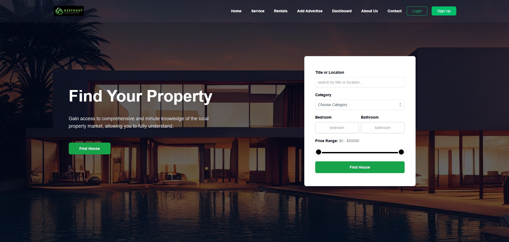

# 🏠 NestHunt – Frontend

**NestHunt** is a full-stack house rental platform where users can list their own properties or rent other's homes. This is the **frontend** built with React.js and Tailwind CSS. It communicates with a Django REST API backend and includes separate dashboards for both users and admins.

🔗 **Live Site:** [nesthunt.vercel.app](https://nesthunt.vercel.app)  
🔗 **Backend Repo:** [NestHunt Backend (Django)](https://github.com/rjmahfuztech/nesthunt)

---

## ✨ Features

- Secure JWT-based login, registration, and Google OAuth
- List houses, browse property details, filter and search
- Add to favorites, send rent requests
- Stripe integration for rental payments
- User dashboard for profile, ads, and booking management
- Admin dashboard for listing approval, analytics, and user control
- Responsive UI with Tailwind CSS

---

## 🚀 Tech Stack

**Frontend:**

- React.js (with Vite)
- Tailwind CSS
- Material Tailwind
- React Router DOM
- Axios
- Stripe.js

**Other Tools:**

- Vercel (Frontend Deployment)
- Google OAuth (via backend)
- ApexCharts
- Framer Motion (For Animation)

---

## 📦 Installation

```bash
git clone https://github.com/rjmahfuztech/nesthunt-client.git
cd nesthunt-client
npm install
npm run dev
```

### 📸 **Screenshots Section**

```markdown
## 📸 Screenshots

**Homepage**  


**Rentals**


**Dashboard statistics**  


**Dashboard House List**

```

## 🙋‍♂️ Author

**Mahfuz Islam**  
🌐 [Portfolio Website](https://mahfuzislam.vercel.app)  
🔗 [LinkedIn](https://linkedin.com/in/mahfuz-islam)  
🐙 [GitHub](https://github.com/rjmahfuztech)
